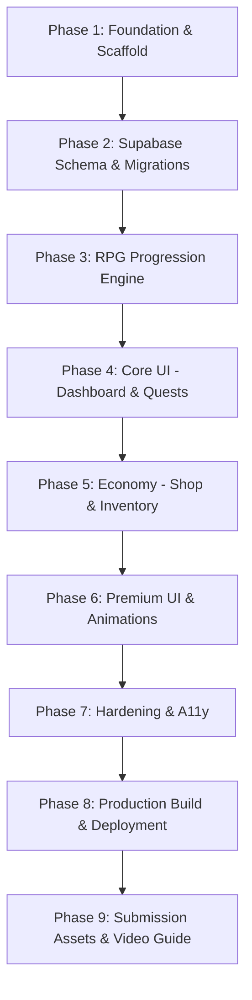

# Implementation Plan — Life RPG Web Application (Production PRD)

Build a production-quality, full-stack **Life RPG** web application based on [`Life_RPG_Web_App_PRD.md`](file:///c:/Users/owner/OneDrive/Desktop/Hackathon%20project%27/Life%20RPG/Life_RPG_Web_App_PRD.md). The application transforms real-world responsibilities into quests with an authoritative RPG progression loop: **Task → Quest → Completion → Authoritative XP + Gold + Attribute XP → Level Up → Streaks & Achievements → Armory/Shop**.

---

## User Review Required

> [!IMPORTANT]
> **Authoritative Server Engine & Supabase**: Per Section 4.5 & Section 21 of the PRD, the browser is **never** trusted for XP, Gold, Level, Attributes, Streaks, or Inventory. All mutations run via Server Actions / PostgreSQL transactions. Client animations (GSAP/Framer Motion) animate only after the server confirms authoritative values.

> [!TIP]
> **Premium UI System (Animmaster / Skiper / Vengeance Patterns)**: Per Sections 10–14 of the PRD, the frontend will integrate high-impact, polished interactions inspired by Animmaster Lib, Skiper UI, and Vengeance UI:
> - **Animated Number Rollers & Stat Tickers** (Skiper / Vengeance style) for XP and Gold transitions.
> - **Glow Border & Bento Grid Cards** (Vengeance style) for Quests, Attributes, and the Armory Shop.
> - **Magnetic / Fluid Animated Navigation** (Skiper style) with active indicator gliding.
> - **Epic GSAP Level-Up Fanfare** with canvas particle explosions and screen shake.
> - **Atmospheric Dark Fantasy RPG Theme** with deep void surfaces, gold rune accents, and mana-blue borders.

---

## Open Questions

- **Supabase Project Credentials**: Do you already have a live Supabase project URL and Anon key ready to put into `.env.local`, or shall we create the local `.env.example` and full SQL migrations (`001_initial_schema.sql` through `004_seed_data.sql`) with a seamless dev-mode fallback so you can plug your credentials in anytime? *(We will provide both complete migration scripts and immediate local testability).*
- **Display Font Preference**: We recommend **Cinzel Decorative** / **Cinzel** (Google Fonts) for game headings/levels combined with **Outfit** / **Inter** for clean UI readability.

---

## Architecture & Technology Stack

- **Framework**: Next.js App Router (React 19 / 18, TypeScript)
- **Styling**: Tailwind CSS with custom Life RPG Design Tokens (Void, Obsidian, Mythic Gold, Arcane Blue, Rarity tiers)
- **Animation System (Two-Tier)**:
  - **Tier 1 (Micro-interactions)**: Framer Motion + CSS transitions (hover states, modal overlays, tooltips, tab sliders, magnetic pills).
  - **Tier 2 (Major Sequences)**: GSAP + Canvas Confetti (Quest completion impact, XP progress fill, Level-Up modal explosion, count-up tickers).
- **Backend & Database**: Supabase PostgreSQL + Supabase Auth + Row Level Security (RLS).
  - Client auth handled with `@supabase/ssr` (cookie-based Next.js sessions).
- **Icons**: Lucide React.
- **Validation**: Zod for form inputs and server action schemas.

---

## Phased Implementation Sequence (Phases 1 to 9)

### Phase 1 — Foundation & Base Layout
- Initialize Git repository and commit baseline.
- Create `AGENTS.md` and `IMPLEMENTATION_STATUS.md`.
- Scaffold Next.js App Router project with TypeScript, Tailwind CSS, Lucide React, GSAP, Framer Motion, and Zod.
- Configure Design System Tokens in Tailwind & CSS variables (`colors`, `radii`, `typography`, `shadows`, `glows`).
- Implement Supabase clients (`lib/supabase/client.ts`, `lib/supabase/server.ts`, `lib/supabase/middleware.ts`) using `@supabase/ssr`.
- Build Auth routes (`/login`, `/signup`, `/auth/callback`) with session protection and redirects.

### Phase 2 — Database Schema & Migrations
Create clean, idempotent SQL migrations in `supabase/migrations/`:
- `001_initial_schema.sql`:
  - `profiles`: `id` (PK, references `auth.users`), `username`, `display_name`, `avatar_url`, `created_at`.
  - `characters`: `user_id` (PK), `level`, `xp`, `gold`, `strength`, `intellect`, `endurance`, `wisdom`, `focus`, `current_streak`, `best_streak`, `last_activity_date`.
  - `quests`: `id` (UUID), `user_id`, `title`, `description`, `category`, `difficulty`, `xp_reward`, `gold_reward`, `attribute_reward`, `is_completed`, `due_at`.
  - `quest_completions`: `id`, `quest_id`, `user_id`, `completed_at`, `xp_earned`, `gold_earned`, `attribute`, `attribute_points` (idempotency key: `(quest_id, user_id)`).
  - `items`: `id`, `name`, `description`, `type`, `rarity`, `price`, `metadata`.
  - `inventory`: `id`, `user_id`, `item_id`, `purchased_at`.
  - `achievements` & `user_achievements`: `id`, `name`, `description`, `type`, `threshold`, `unlocked_at`.
- `002_rls_policies.sql`:
  - Enable RLS on all user tables with `auth.uid() = user_id` policy.
  - Read-only policies on reference catalogs (`items`, `achievements`).
- `003_game_functions.sql`:
  - Atomic PostgreSQL stored procedures for quest completion and item purchases.
- `004_seed_data.sql`:
  - Seed initial catalog items (Titles: *The Awakened*, *Grandmaster*, *Shadow Walker*; Avatar Frames: *Arcane Runic Ring*, *Dragon Gold Border*; Themes) and core achievements.
- `types/database.types.ts`: TypeScript types generated from the schema.

### Phase 3 — Authoritative RPG Progression Engine (`lib/game/`)
Pure, unit-tested engine modules:
- `lib/game/levels.ts`: Non-linear XP curve `xpRequired(level) = round(100 * level ^ 1.5)`. Helper functions for level threshold calculation, progress percentage, multi-level jumps.
- `lib/game/attributes.ts`: Attribute definitions and mappings (Coding/Study → Intellect/Wisdom, Gym/Fitness → Strength, Running → Endurance, Deep Work/Meditation → Focus).
- `lib/game/streaks.ts`: Consecutive calendar-day calculations, handling timezone normalization, same-day no-op, missed-day reset, and best-streak preservation.
- `lib/game/economy.ts`: Strict reward formulas based on difficulty tier (Easy: 50 XP/10 Gold, Normal: 100 XP/20 Gold, Hard: 175 XP/35 Gold, Epic: 300 XP/60 Gold).
- `lib/game/achievements.ts`: Automatic triggers for *First Quest*, *Week Warrior* (7-day streak), *Centurion* (1,000 XP), *Level 10*, *Disciplined* (14-day streak).
- `lib/game/__tests__/engine.test.ts`: Automated unit tests verifying all edge cases.

### Phase 4 — Core UI (Dashboard, Quests & Character)
- **Game Layout & HUD**:
  - Top Game Bar: Character Level Badge, Animated XP bar, Gold Counter, Streak Flame counter, Profile dropdown.
  - Desktop Navigation & Mobile Bottom Navigation Bar (Skiper UI style magnetic hover and active-pill sliding).
- **Dashboard (`/dashboard`)**:
  - Bento Grid layout: Character summary HUD card, 5 Attribute stat gauges, Active Quest Board.
  - Quest list with filter tabs (All, Daily, Strength, Intellect, etc.).
  - Quest Card with rarity borders (Common, Rare, Epic, Legendary), attribute tags, XP/Gold reward preview, and "Complete" button.
- **Quest CRUD**:
  - Modal to create a new Quest with category, difficulty, title, description, and auto-calculated rewards.
  - Edit & Delete quest actions with server-side ownership validation.
- **Character Sanctum (`/character`)**:
  - Detailed character profile, total XP, next level goal, visual attribute cards/bars, and career milestones.

### Phase 5 — Economy (Shop & Inventory)
- **Armory & Shop (`/shop`)**:
  - Catalog of virtual rewards: Profile Titles, Glowing Avatar Frames, Themes, Badges.
  - Atomic purchase verification: server verifies gold balance >= price, deducts gold, unlocks item into `inventory`.
  - Instant visual feedback and purchase confirmation toast.
- **Inventory Vault (`/inventory`)**:
  - Grid of owned items with "Equip" / "Active" toggles.
  - Equipping an item immediately reflects on the player's HUD badge/frame.

### Phase 6 — Premium Frontend & Animations (Animmaster / Skiper / Vengeance Patterns)
- **Animated Numbers** (Skiper / Vengeance pattern): Smooth rolling digits for Gold and XP increments (`useAnimatedCounter` hook).
- **Glow Border & Bento Cards** (Vengeance pattern): Subtle dynamic mouse-tracking glow borders on quest cards and HUD panels.
- **Quest Completion Sequence**:
  - Button compression micro-interaction → instant local quest checkmark → server confirmation → floating `+XP` & `+Gold` flyouts → XP bar fills via GSAP.
- **Epic Level-Up Celebration Modal**:
  - GSAP timeline with screen pulse, sound-effect visual cues, gold particle burst (`canvas-confetti`), level banner expansion, and "Attributes Boosted!" toast.
- **Cinematic Landing Page (`/`)**:
  - Atmospheric hero banner ("Turn Your Life Into A Quest"), animated subtitle, interactive quest card preview, live progression demo, and clear CTA to enter the game.
- Full compliance with `prefers-reduced-motion`.

### Phase 7 — Hardening, Accessibility & Polish
- Keyboard navigation (Tab order, Enter/Space actuation, visible gold focus rings).
- ARIA live announcements for screen readers on XP gains and Level-Up events.
- Skeletons and loading indicators for dashboard, quest list, and shop.
- User-friendly error boundaries for network disconnects, invalid sessions, or insufficient gold.

### Phase 8 — Production Build & Deployment Prep
- Run `npm run lint` and `npx tsc --noEmit`.
- Run `npm run build` to verify clean Next.js production output.
- Prepare deployment instructions for Vercel + Supabase.

### Phase 9 — Submission Assets
- Comprehensive `README.md` with product overview, architecture diagram, setup instructions, and database migration steps.
- Clean `.env.example` with zero secrets.
- Verification of Git commit history (minimum 3 chronological, descriptive commits).
- Demo video walkthrough outline (90–180 seconds, <100 MB).

---

## Proposed File Changes

### Project Scaffold & Config
- [NEW] `package.json`
- [NEW] `tsconfig.json`
- [NEW] `next.config.ts`
- [NEW] `tailwind.config.ts` & `postcss.config.mjs`
- [NEW] `AGENTS.md`
- [NEW] `IMPLEMENTATION_STATUS.md`
- [NEW] `.env.example`
- [NEW] `.gitignore`
- [NEW] `README.md`

### Supabase Migrations & Database Types
- [NEW] `supabase/migrations/001_initial_schema.sql`
- [NEW] `supabase/migrations/002_rls_policies.sql`
- [NEW] `supabase/migrations/003_game_functions.sql`
- [NEW] `supabase/migrations/004_seed_data.sql`
- [NEW] `types/database.types.ts`
- [NEW] `lib/supabase/client.ts`
- [NEW] `lib/supabase/server.ts`
- [NEW] `lib/supabase/middleware.ts`

### Game Progression Engine (`lib/game/`)
- [NEW] `lib/game/levels.ts`
- [NEW] `lib/game/attributes.ts`
- [NEW] `lib/game/streaks.ts`
- [NEW] `lib/game/economy.ts`
- [NEW] `lib/game/achievements.ts`
- [NEW] `lib/game/__tests__/engine.test.ts`

### Server Actions
- [NEW] `app/actions/quests.ts` (create, update, delete, completeQuest)
- [NEW] `app/actions/shop.ts` (purchaseItem, equipItem)
- [NEW] `app/actions/character.ts` (fetchCharacter, updateProfile)

### UI Components (Animmaster / Skiper / Vengeance Inspired)
- [NEW] `components/ui/AnimatedNumber.tsx` (Skiper/Vengeance animated counter)
- [NEW] `components/ui/GlowCard.tsx` (Vengeance style interactive border glow)
- [NEW] `components/layout/GameNav.tsx` & `components/layout/HUDHeader.tsx` (Skiper fluid nav)
- [NEW] `components/rpg/XpProgressBar.tsx` (GSAP smooth fill)
- [NEW] `components/rpg/LevelUpModal.tsx` (GSAP + canvas confetti celebration)
- [NEW] `components/rpg/RewardFlyout.tsx` (Floating +XP and +Gold feedback)
- [NEW] `components/quests/QuestCard.tsx` & `components/quests/CreateQuestModal.tsx`
- [NEW] `components/character/AttributeGrid.tsx` & `components/character/CharacterHero.tsx`
- [NEW] `components/shop/ShopItemCard.tsx` & `components/inventory/InventoryVault.tsx`

### Next.js Pages & Layouts
- [NEW] `app/layout.tsx` & `app/globals.css`
- [NEW] `app/page.tsx` (Cinematic RPG Landing Page)
- [NEW] `app/(auth)/login/page.tsx` & `app/(auth)/signup/page.tsx`
- [NEW] `app/dashboard/page.tsx` (Quest Board & HUD)
- [NEW] `app/character/page.tsx` (Character Sheet)
- [NEW] `app/shop/page.tsx` (Armory & Virtual Store)
- [NEW] `app/inventory/page.tsx` (Player Inventory)
- [NEW] `app/achievements/page.tsx` (Hall of Feats)

---

## Verification Plan

### Automated Checks
1. **Unit Tests**:
   - `node --test` running tests in `lib/game/__tests__/engine.test.ts` covering non-linear XP thresholds, same-day streak deduplication, consecutive day increments, missed-day resets, and achievement triggers.
2. **Type Safety**:
   - `npx tsc --noEmit` passing with 0 errors across all routes, components, and server actions.
3. **Production Build**:
   - `npm run build` verifying static optimization, clean server actions, and no bundle leaks.

### Manual Verification Flows
1. **Authentication & Session**:
   - Register a new account -> character automatically initialized at Level 1 with 0 XP, 0 Gold, and initial stats.
   - Login -> redirected to Dashboard.
   - Page refresh -> session and character state remain intact.
2. **Quest Loop & Authoritative Rewards**:
   - Create a new quest ("Study TypeScript for 45 min", Category: Intellect, Difficulty: Normal).
   - Click "Complete" -> observe button press, floating `+100 XP` and `+20 Gold`, animated number counter increase, and Intellect stat increment.
   - Trigger Level-Up -> test Level-Up modal explosion, confetti, and updated next-level requirement.
   - Browser refresh -> verify database persistence of all gained rewards and completion status.
3. **Shop & Inventory**:
   - Open Shop -> purchase *The Awakened* title -> gold deducted atomically -> verify item appears in Inventory and can be equipped on the HUD.
4. **Accessibility & Responsive**:
   - Verify keyboard focus outlines and full tab navigation.
   - Verify mobile layout (<400px) with bottom navigation and desktop layout (>=1024px) with HUD.
